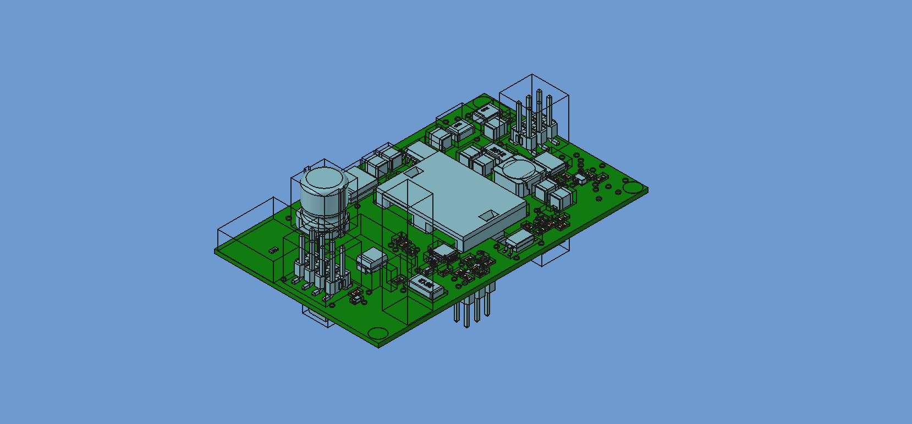

<!-- SPDX-License-Identifier: CC-BY-SA-4.0 -->
<!-- SPDX-FileNotice: Part of the IDF addon. -->

# IDF

Importer for IDF files.  

## What

IDF files are used to interoperate between EDA & CAD software.

The IDF consists of two file types:
-   EMN : PCB outline and component placement
-   EMP : Component outlines and heights